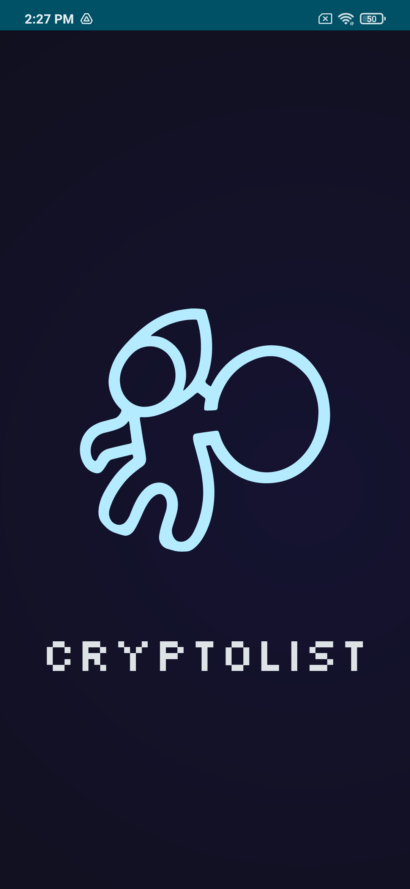
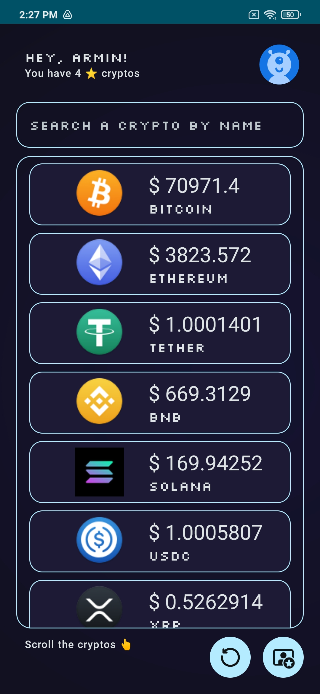
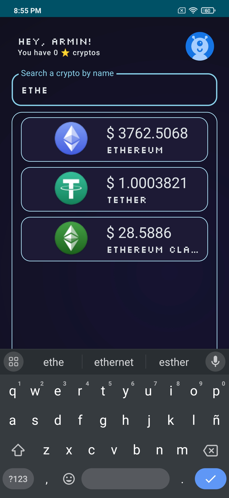
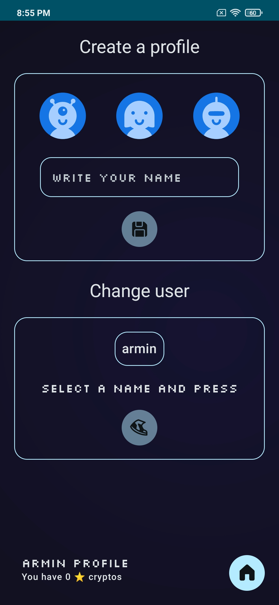
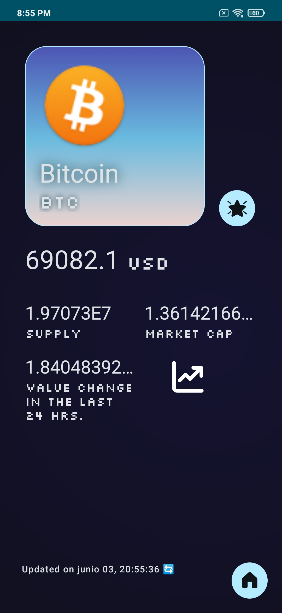
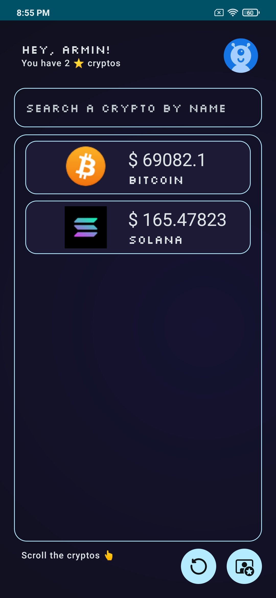

# Cryptolist app

Welcome to the cryptolist app repo that contains its code and resources. 
The project is an Android Application built with Kotlin, Android Jetpack, and a custom theme. 
It shows a list of cryptocurrencies; the user can create a profile and make starred items.

### Screenshots of Cryptolist

| 
              | 
                                                     | 
                                                                                   |
| -------------------------------------------------------------------------------------------------- | --------------------------------------------------------------------------------------------------------------------------------- | --------------------------------------------------------------------------------------------------------------------------------------------------------------- |
| 
Splash screen.                                                                  | 
Main screen. Cryptocoins list.                                                                                 | 
Searching coins that contain "ethe".                                                                                                         |
| 
           | 
                                              | 
                                                                              |
| 
Users profiles screen. You can create a new user or change to an existing user. | 
Detail screen of a coin after pressing a coin from the main screen. The button whit the star has been pressed. | 
Starred coins from the current user are shown after pressing the button with the user and the star located in the bottom of the Main screen. |

## Demo

## Stack

- Android Studio.
- Kotlin.
- Android Jetpack. 🖼 Compose toolkit to build native UI, 🚀 Navigation Component to navigate between different screens, 💾 SQLite DB with the Room abstraction layer.
- MVVM as the architectural pattern.
- API RESTful with the Retrofit2 HTTP client. https://docs.coincap.io/
- Coil library to load images with Kotlin Coroutines.
- TypeConverters for unsuported Data classes into Room.
- NonSQL DB: DataStore. Used for storing preferences.
- 👟 Coroutines.

## Getting Started

### Prerequisites

Before you begin, ensure you have met the following requirements:

- Use Android Studio Jellyfish | 2023.3.1 Patch 1 or later as your IDE.
- Ensure your Android SDK supports versions 24 `minSdk` and 34 `compileSdk`.
- Have Gradle with the 8.6 version.
- Have JDK 1.8 installed.

### Setup

1. Clone the project from its GitHub repository.
2. Open the project in Android Studio Jellyfish | 2023.3.1 Patch 1 or later.
3. Build the project in Android Studio. Gradle will automatically download and set up the dependencies.
